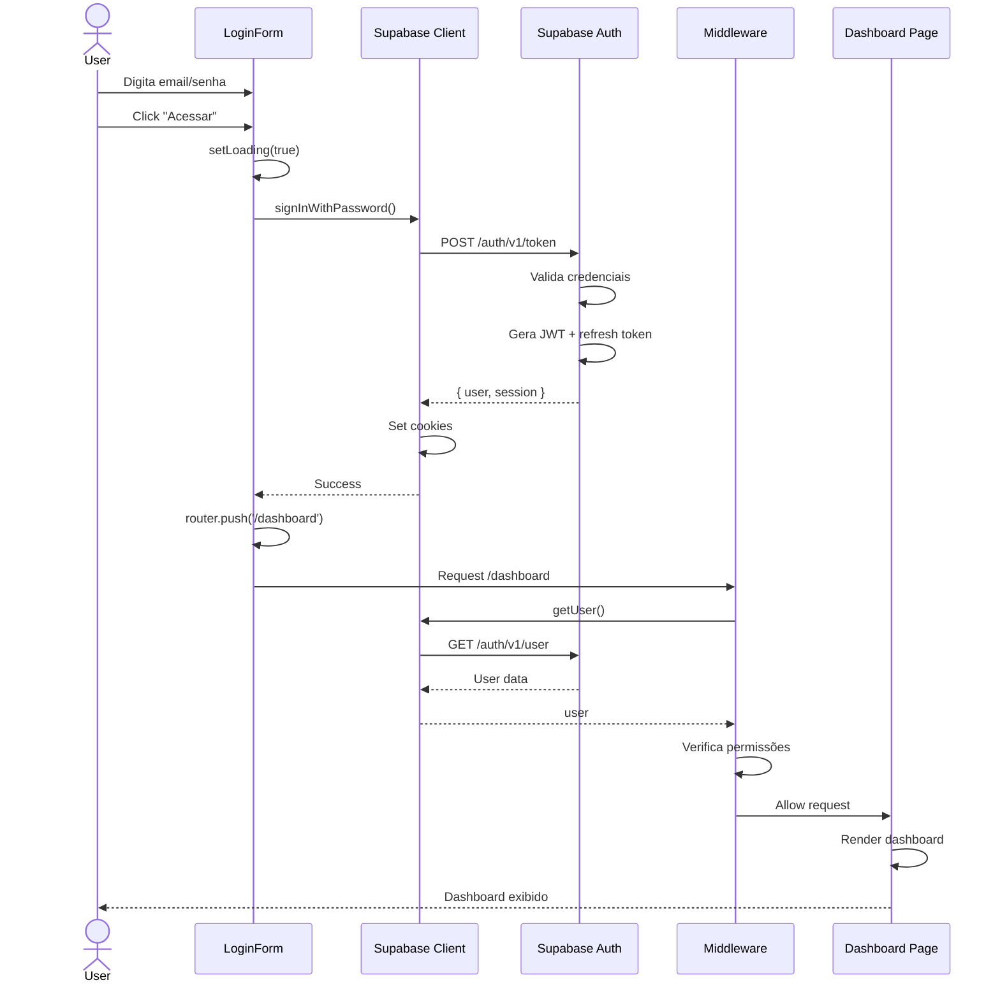
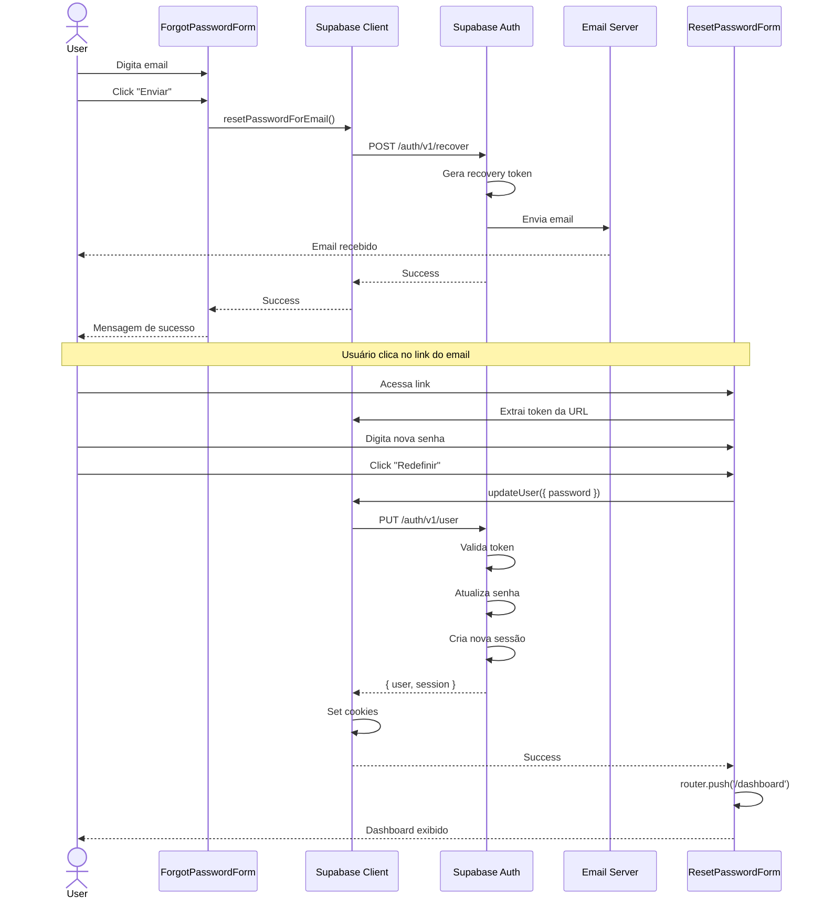

# Fluxo de Integração - Autenticação e Recuperação de Senha

**Última Atualização:** 2025-01-14  
**Versão:** 1.0.0

## Índice

1. [Fluxo de Login](#fluxo-de-login)
2. [Fluxo de Recuperação de Senha](#fluxo-de-recuperação-de-senha)
3. [Fluxo de Redefinição de Senha](#fluxo-de-redefinição-de-senha)
4. [Fluxo de Middleware](#fluxo-de-middleware)
5. [Fluxo de Callback](#fluxo-de-callback)
6. [Fluxo de Logout](#fluxo-de-logout)
7. [Diagramas de Sequência](#diagramas-de-sequência)

---

## Fluxo de Login

### Diagrama ASCII

```
┌─────────┐      ┌──────────────┐      ┌──────────────┐      ┌────────────┐      ┌───────────┐
│ Usuário │      │  LoginForm   │      │   Supabase   │      │ Middleware │      │ Dashboard │
│         │      │  Component   │      │     Auth     │      │            │      │           │
└────┬────┘      └──────┬───────┘      └──────┬───────┘      └─────┬──────┘      └─────┬─────┘
     │                  │                     │                    │                    │
     │  1. Digita       │                     │                    │                    │
     │  email/senha     │                     │                    │                    │
     ├─────────────────>│                     │                    │                    │
     │                  │                     │                    │                    │
     │  2. Submit       │                     │                    │                    │
     ├─────────────────>│                     │                    │                    │
     │                  │                     │                    │                    │
     │                  │  3. signInWithPassword()                 │                    │
     │                  ├────────────────────>│                    │                    │
     │                  │                     │                    │                    │
     │                  │  4. Valida credenciais                   │                    │
     │                  │                     │                    │                    │
     │                  │  5. Cria sessão     │                    │                    │
     │                  │                     │                    │                    │
     │                  │  6. Retorna user + session               │                    │
     │                  │<────────────────────┤                    │                    │
     │                  │                     │                    │                    │
     │                  │  7. Set cookies     │                    │                    │
     │                  │◄────────────────────┤                    │                    │
     │                  │                     │                    │                    │
     │                  │  8. router.push('/dashboard')            │                    │
     │                  ├─────────────────────────────────────────>│                    │
     │                  │                     │                    │                    │
     │                  │                     │  9. Verifica sessão│                    │
     │                  │                     │<───────────────────┤                    │
     │                  │                     │                    │                    │
     │                  │                     │  10. Sessão válida │                    │
     │                  │                     ├───────────────────>│                    │
     │                  │                     │                    │                    │
     │                  │                     │                    │  11. Renderiza     │
     │                  │                     │                    ├───────────────────>│
     │                  │                     │                    │                    │
     │  12. Dashboard   │                     │                    │                    │
     │  carregado       │                     │                    │                    │
     │<─────────────────┴─────────────────────┴────────────────────┴────────────────────┤
     │                                                                                   │
```

### Passos Detalhados

#### 1. Inicialização do Componente
**Arquivo**: `src/components/auth/login-form.tsx` (linha 14-22)

```typescript
export function LoginForm() {
  const [email, setEmail] = useState('')
  const [password, setPassword] = useState('')
  const [showPassword, setShowPassword] = useState(false)
  const [loading, setLoading] = useState(false)
  const [error, setError] = useState<string | null>(null)
  const router = useRouter()
  const searchParams = useSearchParams()
  const supabase = createClient()
```

**Estado Inicial**:
- Campos vazios
- Loading: false
- Error: null
- Cliente Supabase inicializado

---

#### 2. Processamento de Mensagens URL
**Arquivo**: `src/components/auth/login-form.tsx` (linha 27-41)

```typescript
useEffect(() => {
  const message = searchParams.get('message')
  const errorParam = searchParams.get('error')
  const errorDescription = searchParams.get('error_description')

  if (message) {
    const processedMessage = processSupabaseMessage(message)
    setUrlMessage({ type: 'info', text: processedMessage })
  } else if (errorParam) {
    const errorText = errorDescription || errorParam
    setUrlMessage({ type: 'error', text: processErrorMessage(errorText) })
  }
}, [searchParams])
```

**Cenários**:
- `?message=Sessão+expirada` → Alert informativo
- `?error=access_denied` → Alert de erro
- Sem parâmetros → Sem mensagem

---

#### 3. Submissão do Formulário
**Arquivo**: `src/components/auth/login-form.tsx` (linha 121-157)

```typescript
const handleLogin = async (e: React.FormEvent) => {
  e.preventDefault()
  setLoading(true)
  setError(null)

  // Timeout de segurança
  const timeoutId = setTimeout(() => {
    setLoading(false)
    setError('Tempo de login excedido. Tente novamente.')
  }, 10000)

  try {
    // Chamada ao Supabase
    const { error } = await supabase.auth.signInWithPassword({
      email: email.trim(),
      password: password.trim(),
    })

    if (error) {
      clearTimeout(timeoutId)
      setError(getLoginErrorMessage(error))
      setLoading(false)
      return
    }

    // Sucesso - redirecionar
    router.push('/dashboard')
    router.refresh()
    
  } catch (err) {
    clearTimeout(timeoutId)
    console.error('Erro inesperado ao fazer login:', err)
    setError('Erro ao fazer login. Tente novamente.')
    setLoading(false)
  }
}
```

**Estados**:
1. **Antes**: loading = false, error = null
2. **Durante**: loading = true, timeout ativo
3. **Sucesso**: redirect para /dashboard
4. **Erro**: loading = false, error = mensagem

---

#### 4. Validação no Supabase

**Processo Interno do Supabase**:

```
1. Recebe email e password
   ↓
2. Busca usuário em auth.users WHERE email = ?
   ↓
3. Verifica senha com bcrypt.compare()
   ↓
4. Valida email_confirmed_at (se confirmação obrigatória)
   ↓
5. Verifica is_active / banned_until
   ↓
6. Gera JWT (access_token) com claims:
   - sub: user_id
   - email: user_email
   - role: user_role
   - exp: timestamp + 3600s
   ↓
7. Gera refresh_token aleatório
   ↓
8. Salva sessão em auth.sessions
   ↓
9. Retorna { user, session }
```

**Possíveis Erros**:
- Email não existe → `Invalid login credentials`
- Senha incorreta → `Invalid login credentials`
- Email não confirmado → `Email not confirmed`
- Conta desabilitada → `User is disabled`
- Rate limit → `Too many requests`

---

#### 5. Criação de Cookies

**Arquivo**: `src/lib/supabase/client.ts` (linha 4-8)

```typescript
export function createClient() {
  return createBrowserClient<Database>(
    process.env.NEXT_PUBLIC_SUPABASE_URL!,
    process.env.NEXT_PUBLIC_SUPABASE_ANON_KEY!
  )
}
```

**Cookies Criados** (pelo SDK):
```
sb-access-token=eyJhbGciOiJIUzI1NiIs...; HttpOnly; Secure; SameSite=Lax; Path=/; Max-Age=3600
sb-refresh-token=v1.MRjXV...; HttpOnly; Secure; SameSite=Lax; Path=/; Max-Age=2592000
sb-expires-at=1705234567; HttpOnly; Secure; SameSite=Lax; Path=/; Max-Age=3600
```

---

#### 6. Redirecionamento e Middleware

**Arquivo**: `src/middleware.ts` → `src/lib/supabase/middleware.ts` (linha 32-62)

```typescript
const {
  data: { user },
} = await supabase.auth.getUser()

// Verificar se rota é pública
const publicRoutes = ['/login', '/cadastro', '/esqueci-senha', '/redefinir-senha']
const isPublicRoute = publicRoutes.some(route =>
  request.nextUrl.pathname.startsWith(route)
)

// Redirecionar para login se não autenticado
if (!user && !isPublicRoute) {
  const url = request.nextUrl.clone()
  url.pathname = '/login'
  return NextResponse.redirect(url)
}
```

---

#### 7. Carregamento do Dashboard

**Processo**:
1. Middleware valida sessão ✓
2. Next.js renderiza `/dashboard/page.tsx`
3. Server Component busca dados do usuário
4. Componentes carregam dados específicos
5. Dashboard exibido ao usuário

---

## Fluxo de Recuperação de Senha

### Diagrama ASCII

```
┌─────────┐     ┌────────────────────┐     ┌──────────────┐     ┌────────────┐     ┌─────────┐
│ Usuário │     │ ForgotPasswordForm │     │   Supabase   │     │   Email    │     │ Usuário │
│         │     │     Component      │     │     Auth     │     │   Server   │     │         │
└────┬────┘     └─────────┬──────────┘     └──────┬───────┘     └─────┬──────┘     └────┬────┘
     │                    │                       │                   │                  │
     │  1. Digita email   │                       │                   │                  │
     ├───────────────────>│                       │                   │                  │
     │                    │                       │                   │                  │
     │  2. Submit         │                       │                   │                  │
     ├───────────────────>│                       │                   │                  │
     │                    │                       │                   │                  │
     │                    │  3. resetPasswordForEmail()               │                  │
     │                    ├──────────────────────>│                   │                  │
     │                    │                       │                   │                  │
     │                    │                       │  4. Gera token    │                  │
     │                    │                       │     (24h)         │                  │
     │                    │                       │                   │                  │
     │                    │                       │  5. Envia email   │                  │
     │                    │                       ├──────────────────>│                  │
     │                    │                       │                   │                  │
     │                    │  6. Retorna success   │                   │  6. Email        │
     │                    │<──────────────────────┤                   │     entregue     │
     │                    │                       │                   ├─────────────────>│
     │  7. Exibe mensagem │                       │                   │                  │
     │     de sucesso     │                       │                   │                  │
     │<───────────────────┤                       │                   │                  │
     │                    │                       │                   │                  │
     │                    │                       │                   │  8. Clica link   │
     │                    │                       │                   │<─────────────────┤
     │                    │                       │                   │                  │
     │                    │                       │  9. Valida token  │                  │
     │                    │                       │<──────────────────┤                  │
     │                    │                       │                   │                  │
     │                    │                       │  10. Redirect     │                  │
     │                    │                       │   /redefinir-senha│                  │
     │                    │                       ├──────────────────────────────────────>│
     │                    │                       │                   │                  │
```

### Passos Detalhados

#### 1. Submissão do Email
**Arquivo**: `src/components/auth/forgot-password-form.tsx` (linha 19-44)

```typescript
const handleSubmit = async (e: React.FormEvent) => {
  e.preventDefault()
  setLoading(true)
  setError(null)
  setSuccess(false)

  try {
    const { error } = await supabase.auth.resetPasswordForEmail(email.trim(), {
      redirectTo: `${window.location.origin}/redefinir-senha`,
    })

    if (error) {
      console.error('Erro ao enviar email:', error)
      setError('Erro ao enviar email. Verifique o endereço e tente novamente.')
      setLoading(false)
      return
    }

    setSuccess(true)
    setLoading(false)
  } catch (err) {
    console.error('Erro inesperado:', err)
    setError('Erro ao enviar email. Tente novamente.')
    setLoading(false)
  }
}
```

---

#### 2. Processamento no Supabase

**Processo Interno**:

```
1. Recebe email
   ↓
2. Busca usuário em auth.users WHERE email = ?
   ↓
3. Se encontrado:
   - Gera recovery_token (UUID seguro)
   - Define recovery_sent_at = NOW()
   - Salva no banco
   ↓
4. Envia email com template de recuperação:
   - Subject: "Redefinição de senha"
   - Link: ${redirectTo}?code=${recovery_token}
   - Validade: 24 horas
   ↓
5. SEMPRE retorna success (por segurança)
   - Não revela se email existe ou não
```

---

#### 3. Template de Email

**Configuração no Supabase Dashboard** → Authentication → Email Templates

```html
<!DOCTYPE html>
<html>
<head>
  <meta charset="utf-8">
  <title>Redefinição de Senha</title>
</head>
<body>
  <h2>Redefinição de Senha</h2>
  
  <p>Olá,</p>
  
  <p>Você solicitou a redefinição de senha para sua conta no BI SaaS.</p>
  
  <p>Clique no link abaixo para criar uma nova senha:</p>
  
  <p>
    <a href="{{ .ConfirmationURL }}" style="
      background-color: #10b981;
      color: white;
      padding: 12px 24px;
      text-decoration: none;
      border-radius: 6px;
      display: inline-block;
    ">
      Redefinir Senha
    </a>
  </p>
  
  <p>Este link expira em 24 horas.</p>
  
  <p>Se você não solicitou esta redefinição, ignore este email.</p>
  
  <hr>
  <p style="color: #666; font-size: 12px;">
    BI SaaS Dashboard - DevIngá<br>
    Suporte: +55 44 99722-3315
  </p>
</body>
</html>
```

---

#### 4. Feedback ao Usuário

**Arquivo**: `src/components/auth/forgot-password-form.tsx` (linha 46-58)

```typescript
if (success) {
  return (
    <CardContent className="space-y-4 pb-4">
      <Alert className="border-green-200 bg-green-50">
        <CheckCircle2 className="h-4 w-4 text-green-600" />
        <AlertDescription className="text-green-800">
          Email enviado com sucesso! Verifique sua caixa de entrada e siga as
          instruções para redefinir sua senha.
        </AlertDescription>
      </Alert>
    </CardContent>
  )
}
```

---

## Fluxo de Redefinição de Senha

### Diagrama ASCII

```
┌─────────┐     ┌──────────────────┐     ┌──────────────┐     ┌────────────┐     ┌───────────┐
│ Usuário │     │ ResetPasswordForm│     │   Supabase   │     │ Middleware │     │ Dashboard │
│         │     │    Component     │     │     Auth     │     │            │     │           │
└────┬────┘     └────────┬─────────┘     └──────┬───────┘     └─────┬──────┘     └─────┬─────┘
     │                   │                      │                   │                   │
     │  1. Clica link    │                      │                   │                   │
     │  do email         │                      │                   │                   │
     ├──────────────────>│                      │                   │                   │
     │                   │                      │                   │                   │
     │                   │  2. Extrai token     │                   │                   │
     │                   │     da URL           │                   │                   │
     │                   │                      │                   │                   │
     │  3. Digita nova   │                      │                   │                   │
     │     senha         │                      │                   │                   │
     ├──────────────────>│                      │                   │                   │
     │                   │                      │                   │                   │
     │  4. Submit        │                      │                   │                   │
     ├──────────────────>│                      │                   │                   │
     │                   │                      │                   │                   │
     │                   │  5. updateUser({ password })             │                   │
     │                   ├─────────────────────>│                   │                   │
     │                   │                      │                   │                   │
     │                   │                      │  6. Valida token  │                   │
     │                   │                      │                   │                   │
     │                   │                      │  7. Atualiza      │                   │
     │                   │                      │     senha         │                   │
     │                   │                      │                   │                   │
     │                   │                      │  8. Cria sessão   │                   │
     │                   │                      │                   │                   │
     │                   │  9. Retorna user     │                   │                   │
     │                   │<─────────────────────┤                   │                   │
     │                   │                      │                   │                   │
     │                   │  10. router.push('/dashboard')           │                   │
     │                   ├─────────────────────────────────────────>│                   │
     │                   │                      │                   │                   │
     │                   │                      │  11. Verifica     │                   │
     │                   │                      │      sessão       │                   │
     │                   │                      │<──────────────────┤                   │
     │                   │                      │                   │                   │
     │                   │                      │                   │  12. Renderiza    │
     │                   │                      │                   ├──────────────────>│
     │                   │                      │                   │                   │
     │  13. Dashboard    │                      │                   │                   │
     │      carregado    │                      │                   │                   │
     │<──────────────────┴──────────────────────┴───────────────────┴───────────────────┤
     │                                                                                   │
```

### Passos Detalhados

#### 1. Validação de Senha
**Arquivo**: `src/components/auth/reset-password-form.tsx` (linha 18-36)

```typescript
const handleSubmit = async (e: React.FormEvent) => {
  e.preventDefault()
  setLoading(true)
  setError(null)

  const trimmedPassword = password.trim()

  // Validações
  if (trimmedPassword.length < 6) {
    setError('A senha deve ter pelo menos 6 caracteres')
    setLoading(false)
    return
  }

  if (trimmedPassword !== confirmPassword.trim()) {
    setError('As senhas não coincidem')
    setLoading(false)
    return
  }
```

---

#### 2. Atualização da Senha
**Arquivo**: `src/components/auth/reset-password-form.tsx` (linha 38-62)

```typescript
  try {
    console.log('Atualizando senha...')

    const { error } = await supabase.auth.updateUser({
      password: trimmedPassword,
    })

    if (error) {
      console.error('Erro ao atualizar senha:', error)
      setError(error.message)
      setLoading(false)
      return
    }

    console.log('Senha atualizada com sucesso')

    // Redireciona para o dashboard
    router.push('/dashboard')
    router.refresh()
  } catch (err) {
    console.error('Erro inesperado:', err)
    setError('Erro ao redefinir senha. Tente novamente.')
    setLoading(false)
  }
}
```

---

#### 3. Processamento no Supabase

**Processo Interno**:

```
1. Recebe password + token (do cookie/header)
   ↓
2. Busca auth.sessions com recovery_token
   ↓
3. Valida:
   - Token existe?
   - Token não expirado? (< 24h)
   - Token não usado anteriormente?
   ↓
4. Se válido:
   - Criptografa nova senha (bcrypt)
   - Atualiza auth.users.encrypted_password
   - Define updated_at = NOW()
   - Invalida recovery_token
   ↓
5. Cria nova sessão automaticamente:
   - Gera access_token (JWT)
   - Gera refresh_token
   - Salva em auth.sessions
   ↓
6. Retorna { user, session }
```

---

## Fluxo de Middleware

### Diagrama de Verificação

```
                    ┌────────────────────────────────┐
                    │   Requisição para /dashboard   │
                    └───────────────┬────────────────┘
                                    │
                                    ▼
                    ┌────────────────────────────────┐
                    │   Middleware intercepta        │
                    └───────────────┬────────────────┘
                                    │
                                    ▼
                    ┌────────────────────────────────┐
                    │  Lê cookies de sessão          │
                    │  (sb-access-token, etc)        │
                    └───────────────┬────────────────┘
                                    │
                                    ▼
                    ┌────────────────────────────────┐
                    │  supabase.auth.getUser()       │
                    └───────────────┬────────────────┘
                                    │
                    ┌───────────────┴────────────────┐
                    │                                │
                    ▼                                ▼
        ┌───────────────────┐            ┌───────────────────┐
        │  Usuário autenticado│            │  Sem autenticação │
        │  (user !== null)    │            │  (user === null)  │
        └──────────┬──────────┘            └──────────┬────────┘
                   │                                  │
                   ▼                                  ▼
        ┌───────────────────┐            ┌───────────────────┐
        │  Rota é pública?  │            │  Redirect para    │
        │  (login, etc)     │            │  /login           │
        └──────────┬────────┘            └───────────────────┘
                   │
       ┌───────────┴────────────┐
       │                        │
       ▼                        ▼
┌──────────────┐      ┌────────────────────┐
│ Sim          │      │ Não                │
│ Redirect     │      │ Verifica permissões│
│ /dashboard   │      │                    │
└──────────────┘      └──────────┬─────────┘
                                 │
                    ┌────────────┴────────────┐
                    │                         │
                    ▼                         ▼
        ┌────────────────────┐    ┌────────────────────┐
        │ Rota admin?        │    │ Rota pública?      │
        │ Verifica role      │    │ Permite acesso     │
        └──────────┬─────────┘    └────────────────────┘
                   │
       ┌───────────┴───────────┐
       │                       │
       ▼                       ▼
┌──────────────┐    ┌────────────────────┐
│ Admin/Super? │    │ User comum?        │
│ Permite      │    │ Redirect /dashboard│
└──────────────┘    └────────────────────┘
```

---

## Fluxo de Callback

### Processamento de Callback

**Arquivo**: `src/app/api/auth/callback/route.ts`

```typescript
export async function GET(request: Request) {
  const { searchParams, origin } = new URL(request.url)
  const code = searchParams.get('code')
  const next = searchParams.get('next') ?? '/dashboard'
  const error = searchParams.get('error')
  const errorDescription = searchParams.get('error_description')

  // Caso 1: Erro do Supabase
  if (error) {
    const message = encodeURIComponent(errorDescription || error)
    return NextResponse.redirect(`${origin}/login?error=${message}`)
  }

  // Caso 2: Código de autenticação
  if (code) {
    const supabase = await createClient()
    const { error: exchangeError } = await supabase.auth.exchangeCodeForSession(code)
    
    if (!exchangeError) {
      const type = searchParams.get('type')
      
      // Caso 2a: Mudança de email
      if (type === 'email_change') {
        const message = encodeURIComponent('Alteração de email confirmada!')
        return NextResponse.redirect(`${origin}/login?message=${message}`)
      }
      
      // Caso 2b: Login/recuperação normal
      return NextResponse.redirect(`${origin}${next}`)
    }
    
    // Caso 2c: Erro ao trocar código
    const message = encodeURIComponent('Erro ao confirmar. O link pode estar expirado.')
    return NextResponse.redirect(`${origin}/login?error=${message}`)
  }

  // Caso 3: Sem código
  return NextResponse.redirect(`${origin}/login`)
}
```

**Cenários**:

| URL | Ação |
|-----|------|
| `/api/auth/callback?code=abc123` | Troca código por sessão → `/dashboard` |
| `/api/auth/callback?code=abc123&type=email_change` | Confirma email → `/login?message=...` |
| `/api/auth/callback?error=invalid_code` | Erro → `/login?error=...` |
| `/api/auth/callback` | Sem params → `/login` |

---

## Fluxo de Logout

### Processo de Logout

```typescript
// Em qualquer componente
const handleLogout = async () => {
  const supabase = createClient()
  
  // 1. Chamar método de logout
  await supabase.auth.signOut()
  
  // 2. Cookies são limpos automaticamente
  
  // 3. Redirecionar para login
  router.push('/login')
  router.refresh()
}
```

**O que acontece**:
1. `signOut()` invalida sessão no servidor
2. Remove cookies: `sb-access-token`, `sb-refresh-token`
3. Limpa localStorage (se usado)
4. Middleware detecta ausência de sessão
5. Próxima requisição redireciona para `/login`

---

## Diagramas de Sequência

### Sequência Completa: Login → Dashboard



---

### Sequência: Recuperação → Redefinição



---

## Estados de Carregamento

### Timeline de Estados - Login

```
t=0ms    │ Página carrega
         │ loading: false
         │ error: null
         │
t=100ms  │ Usuário digita email/senha
         │ email: "usuario@exemplo.com"
         │ password: "senha123"
         │
t=500ms  │ Usuário clica "Acessar"
         │ loading: true ← Estado muda
         │
t=600ms  │ Chamada HTTP para Supabase
         │ POST /auth/v1/token
         │
t=1200ms │ Resposta recebida
         │ Success: { user, session }
         │
t=1210ms │ Cookies são definidos
         │ sb-access-token, sb-refresh-token
         │
t=1220ms │ Redirect iniciado
         │ router.push('/dashboard')
         │
t=1300ms │ Middleware verifica sessão
         │ getUser() → válido
         │
t=1400ms │ Dashboard renderiza
         │ loading: false (implícito)
         │
t=2000ms │ Dashboard completamente carregado
         │ Dados do usuário exibidos
```

---

## Referências

### Documentação Relacionada
- [BUSINESS_RULES.md](./BUSINESS_RULES.md) - Regras de negócio
- [DATA_STRUCTURES.md](./DATA_STRUCTURES.md) - Estruturas de dados
- [SECURITY.md](./SECURITY.md) - Aspectos de segurança

### Links Externos
- [Supabase Auth Flow](https://supabase.com/docs/guides/auth/auth-helpers/nextjs)
- [Next.js Middleware](https://nextjs.org/docs/app/building-your-application/routing/middleware)

---

**Última Revisão:** 2025-01-14  
**Próxima Revisão:** 2025-04-14
