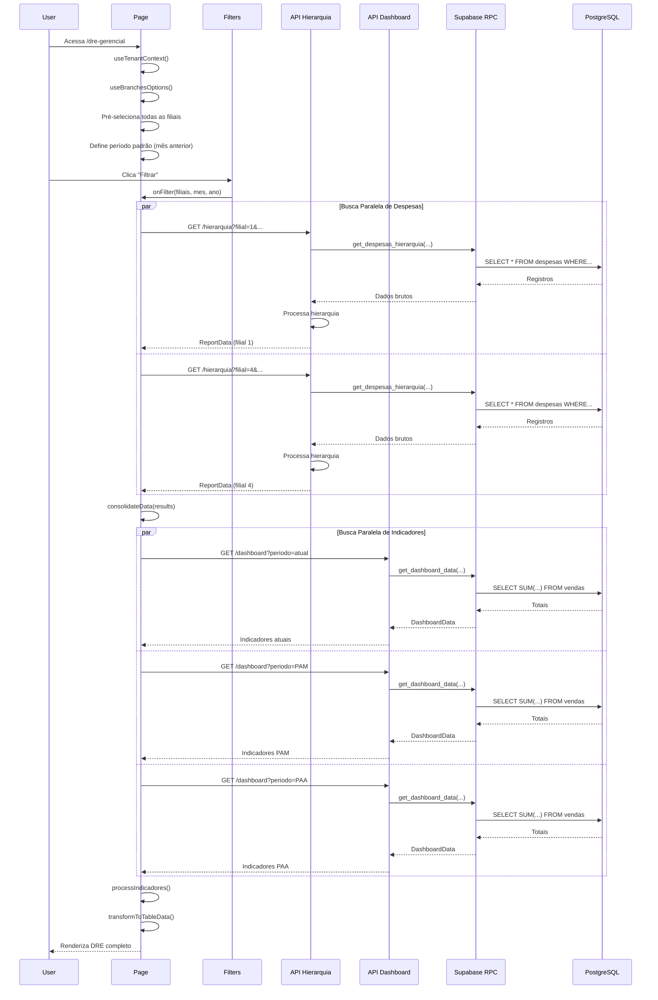
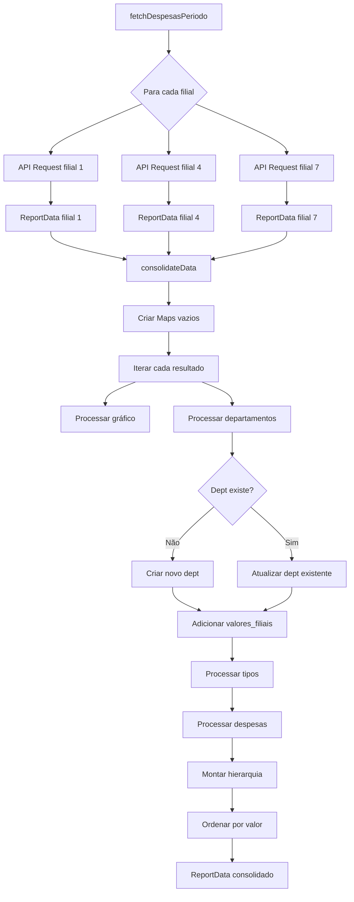

# DRE Gerencial - Fluxo de Integração

## Índice

1. [Visão Geral do Fluxo](#visão-geral-do-fluxo)
2. [Fluxo de Inicialização](#fluxo-de-inicialização)
3. [Fluxo de Aplicação de Filtros](#fluxo-de-aplicação-de-filtros)
4. [Fluxo de Busca de Despesas](#fluxo-de-busca-de-despesas)
5. [Fluxo de Busca de Indicadores](#fluxo-de-busca-de-indicadores)
6. [Fluxo de Consolidação Multi-Filial](#fluxo-de-consolidação-multi-filial)
7. [Fluxo de Renderização](#fluxo-de-renderização)
8. [Diagramas de Sequência](#diagramas-de-sequência)
9. [Tratamento de Erros](#tratamento-de-erros)

---

## Visão Geral do Fluxo

O módulo DRE Gerencial executa os seguintes fluxos principais:

```
1. INICIALIZAÇÃO
   ├── Carregar contexto do tenant
   ├── Buscar filiais disponíveis
   └── Pré-selecionar todas as filiais

2. APLICAÇÃO DE FILTROS
   ├── Usuário seleciona filiais, mês e ano
   └── Clica no botão "Filtrar"

3. BUSCA DE DADOS (PARALELA)
   ├── Busca despesas para período atual
   ├── Busca despesas para PAM (mês anterior)
   ├── Busca despesas para PAA (ano anterior)
   ├── Busca indicadores do dashboard (atual)
   ├── Busca indicadores do dashboard (PAM)
   └── Busca indicadores do dashboard (PAA)

4. CONSOLIDAÇÃO
   ├── Consolidar dados de múltiplas filiais
   ├── Processar hierarquia (Dept → Tipo → Despesa)
   └── Calcular indicadores com comparações

5. RENDERIZAÇÃO
   ├── Exibir cards de indicadores
   └── Exibir tabela hierárquica
```

---

## Fluxo de Inicialização

### 1.1. Carregamento do Contexto

**Componente**: [page.tsx](../../../src/app/(dashboard)/dre-gerencial/page.tsx:93-98)

```typescript
// 1. Obter contexto do tenant e usuário
const { currentTenant, userProfile } = useTenantContext()

// 2. Buscar lista de filiais
const { branchOptions: branches, isLoading: isLoadingBranches } = useBranchesOptions({
  tenantId: currentTenant?.id,
  enabled: !!currentTenant,
  includeAll: false
})
```

**Sequência**:
```
User acessa /dre-gerencial
    ↓
Middleware verifica autenticação
    ↓
TenantProvider carrega dados do tenant
    ↓
useBranchesOptions busca filiais
    ↓
    ├── GET /api/branches?tenant_id={id}
    ↓   ↓
    │   └→ RPC: get_branches()
    ↓       ↓
    │       └→ Retorna: FilialOption[]
    ↓
Filiais disponíveis carregadas
```

---

### 1.2. Pré-seleção de Filiais

**Componente**: [page.tsx](../../../src/app/(dashboard)/dre-gerencial/page.tsx:119-123)

```typescript
useEffect(() => {
  if (!isLoadingBranches && branches && branches.length > 0 && filiaisSelecionadas.length === 0) {
    setFiliaisSelecionadas(branches)  // Seleciona TODAS
  }
}, [isLoadingBranches, branches, filiaisSelecionadas.length])
```

**Condições**:
- ✅ Filiais carregadas (`!isLoadingBranches`)
- ✅ Existe pelo menos 1 filial (`branches.length > 0`)
- ✅ Nenhuma filial ainda selecionada (`filiaisSelecionadas.length === 0`)

---

### 1.3. Definição de Período Padrão

**Componente**: [page.tsx](../../../src/app/(dashboard)/dre-gerencial/page.tsx:101-107)

```typescript
const hoje = new Date()
const mesAnterior = hoje.getMonth() - 1 < 0 ? 11 : hoje.getMonth() - 1
const anoMesAnterior = hoje.getMonth() - 1 < 0 ? hoje.getFullYear() - 1 : hoje.getFullYear()

const [mes, setMes] = useState<number>(mesAnterior)
const [ano, setAno] = useState<number>(anoMesAnterior)
```

**Exemplos**:
- Hoje = 15/01/2025 → Período padrão = Dezembro/2024
- Hoje = 15/06/2024 → Período padrão = Maio/2024

---

### 1.4. Log de Acesso

**Componente**: [page.tsx](../../../src/app/(dashboard)/dre-gerencial/page.tsx:126-135)

```typescript
useEffect(() => {
  if (userProfile?.id && currentTenant?.id) {
    logModuleAccess({
      module: 'despesas',
      tenantId: currentTenant.id,
      userName: userProfile.full_name || 'Usuário',
      userEmail: userProfile.id,
    })
  }
}, [userProfile?.id, currentTenant?.id, userProfile?.full_name])
```

---

### 1.5. Carregamento Inicial de Dados

**Componente**: [page.tsx](../../../src/app/(dashboard)/dre-gerencial/page.tsx:333-338)

```typescript
useEffect(() => {
  if (currentTenant?.supabase_schema && filiaisSelecionadas.length > 0 && !isLoadingBranches && !data) {
    handleFilter(filiaisSelecionadas, mes, ano)
  }
}, [currentTenant?.supabase_schema, filiaisSelecionadas.length, isLoadingBranches, data])
```

**Condições para auto-carga**:
- ✅ Schema do tenant disponível
- ✅ Filiais selecionadas
- ✅ Filiais terminaram de carregar
- ✅ Dados ainda não foram carregados

---

## Fluxo de Aplicação de Filtros

### 2.1. Interação do Usuário

**Componente**: [filters.tsx](../../../src/components/despesas/filters.tsx:73-81)

```typescript
// Estados locais (não aplicados ainda)
const [localFiliais, setLocalFiliais] = useState<FilialOption[]>(filiaisSelecionadas)
const [localMes, setLocalMes] = useState<number>(mes)
const [localAno, setLocalAno] = useState<number>(ano)

// Aplicar filtros ao clicar no botão
const handleFilter = () => {
  setFiliaisSelecionadas(localFiliais)  // Atualiza estado global
  setMes(localMes)
  setAno(localAno)

  onFilter(localFiliais, localMes, localAno)  // Chama função da página
}
```

**Fluxo**:
```
Usuário seleciona filiais → localFiliais atualizado (local)
Usuário seleciona mês     → localMes atualizado (local)
Usuário seleciona ano     → localAno atualizado (local)
    ↓
Usuário clica "Filtrar"
    ↓
Estados globais atualizados
    ↓
onFilter() chamado
    ↓
handleFilter() da página executado
```

---

### 2.2. Validação de Mudanças

**Componente**: [filters.tsx](../../../src/components/despesas/filters.tsx:84-87)

```typescript
const hasChanges =
  localFiliais.map(f => f.value).sort().join(',') !== filiaisSelecionadas.map(f => f.value).sort().join(',') ||
  localMes !== mes ||
  localAno !== ano
```

**Comportamento**:
- Botão "Filtrar" fica **disabled** se `!hasChanges`
- Evita requisições desnecessárias

---

## Fluxo de Busca de Despesas

### 3.1. Início da Busca

**Componente**: [page.tsx](../../../src/app/(dashboard)/dre-gerencial/page.tsx:138-178)

```typescript
const handleFilter = async (filiais: FilialOption[], mesParam: number, anoParam: number) => {
  setLoading(true)
  setLoadingIndicadores(true)
  setError('')

  try {
    // 1. Calcular datas dos períodos
    const { dataInicio, dataFim } = getDatasMesAno(mesParam, anoParam)
    const { dataInicio: dataInicioPam, dataFim: dataFimPam } = getDatasMesAno(mesPam, anoPam)
    const { dataInicio: dataInicioPaa, dataFim: dataFimPaa } = getDatasMesAno(mesParam, anoParam - 1)

    // 2. Buscar em paralelo
    const [dataAtual, despesasPam, despesasPaa] = await Promise.all([
      fetchDespesasPeriodo(filiais, dataInicio, dataFim),
      fetchDespesasPeriodo(filiais, dataInicioPam, dataFimPam),
      fetchDespesasPeriodo(filiais, dataInicioPaa, dataFimPaa)
    ])

    // 3. Armazenar dados
    setData(dataAtual)
    setDataPam(despesasPam)
    setDataPaa(despesasPaa)

    // 4. Buscar indicadores
    await fetchIndicadores(filiais, mesParam, anoParam, dataAtual, despesasPam, despesasPaa)
  } catch (err) {
    setError(err.message)
  }
}
```

---

### 3.2. Cálculo de Datas

**Componente**: [page.tsx](../../../src/app/(dashboard)/dre-gerencial/page.tsx:341-348)

```typescript
const getDatasMesAno = (mesParam: number, anoParam: number) => {
  const dataInicio = startOfMonth(new Date(anoParam, mesParam))
  const dataFim = endOfMonth(new Date(anoParam, mesParam))
  return {
    dataInicio: format(dataInicio, 'yyyy-MM-dd'),
    dataFim: format(dataFim, 'yyyy-MM-dd')
  }
}
```

**Exemplo**:
```typescript
getDatasMesAno(9, 2024)  // Outubro de 2024
// Retorna: { dataInicio: '2024-10-01', dataFim: '2024-10-31' }
```

---

### 3.3. Busca Multi-Filial Paralela

**Componente**: [page.tsx](../../../src/app/(dashboard)/dre-gerencial/page.tsx:183-223)

```typescript
const fetchDespesasPeriodo = async (
  filiais: FilialOption[],
  dataInicio: string,
  dataFim: string
): Promise<ReportData | null> => {
  const filiaisParaBuscar = filiais.map(f => parseInt(f.value)).filter(id => !isNaN(id))

  // Criar uma Promise para cada filial
  const promises = filiaisParaBuscar.map(async (filialId) => {
    const params = new URLSearchParams({
      schema: currentTenant.supabase_schema || '',
      filial_id: filialId.toString(),
      data_inicial: dataInicio,
      data_final: dataFim,
    })

    const response = await fetch(`/api/dre-gerencial/hierarquia?${params}`)
    const result = await response.json()

    if (!response.ok) {
      throw new Error(result.error || 'Erro ao buscar dados')
    }

    return { filialId, data: result }
  })

  // Aguardar todas as requisições
  const results = await Promise.all(promises)

  // Consolidar dados
  return consolidateData(results)
}
```

**Fluxo para 3 filiais**:
```
fetchDespesasPeriodo([fil1, fil4, fil7], '2024-10-01', '2024-10-31')
    ↓
Promise.all([
  fetch('/api/dre-gerencial/hierarquia?schema=okilao&filial_id=1&...'),
  fetch('/api/dre-gerencial/hierarquia?schema=okilao&filial_id=4&...'),
  fetch('/api/dre-gerencial/hierarquia?schema=okilao&filial_id=7&...')
])
    ↓
[
  { filialId: 1, data: {...} },
  { filialId: 4, data: {...} },
  { filialId: 7, data: {...} }
]
    ↓
consolidateData(results)
    ↓
ReportData (consolidado)
```

---

### 3.4. Processamento da API

**API Route**: [hierarquia/route.ts](../../../src/app/api/dre-gerencial/hierarquia/route.ts:5-251)

```typescript
export async function GET(request: NextRequest) {
  // 1. Verificar autenticação
  const { data: { user } } = await supabase.auth.getUser()
  if (!user) return NextResponse.json({ error: 'Não autenticado' }, { status: 401 })

  // 2. Obter parâmetros
  const schema = searchParams.get('schema')
  const filial_id = searchParams.get('filial_id')
  const data_inicial = searchParams.get('data_inicial')
  const data_final = searchParams.get('data_final')

  // 3. Validar parâmetros
  if (!schema || !data_inicial || !data_final) {
    return NextResponse.json({ error: 'Parâmetros obrigatórios...' }, { status: 400 })
  }

  // 4. Verificar permissões de filial
  const authorizedBranches = await getUserAuthorizedBranchCodes(supabase, user.id)
  // ... lógica de autorização

  // 5. Chamar RPC
  const { data: resultData, error: rpcError } = await supabase.rpc('get_despesas_hierarquia', {
    p_schema: schema,
    p_filial_id: finalFilialId,
    p_data_inicial: data_inicial,
    p_data_final: data_final,
    p_tipo_data: 'data_emissao'
  })

  // 6. Processar hierarquia
  const departamentosMap = new Map()
  const tiposMap = new Map()
  // ... processamento

  // 7. Retornar dados estruturados
  return NextResponse.json({
    totalizador: { ... },
    grafico: [...],
    departamentos: [...]
  })
}
```

---

### 3.5. Chamada RPC Supabase

**Function**: `get_despesas_hierarquia`

```sql
-- Pseudocódigo (função real está no banco)
CREATE FUNCTION get_despesas_hierarquia(
  p_schema TEXT,
  p_filial_id INTEGER,
  p_data_inicial DATE,
  p_data_final DATE,
  p_tipo_data TEXT
)
RETURNS TABLE (...)
AS $$
BEGIN
  -- Executar query no schema dinâmico
  RETURN QUERY EXECUTE format('
    SELECT
      dd.id AS dept_id,
      dd.descricao AS dept_descricao,
      td.id AS tipo_id,
      td.descricao AS tipo_descricao,
      d.data_emissao,
      d.descricao_despesa,
      d.fornecedor_id AS id_fornecedor,
      d.numero_nota,
      d.serie_nota,
      d.valor,
      d.usuario,
      d.observacao
    FROM %I.despesas d
    JOIN %I.departamentos_despesas dd ON d.dept_id = dd.id
    JOIN %I.tipos_despesas td ON d.tipo_id = td.id
    WHERE d.filial_id = $1
      AND d.%I BETWEEN $2 AND $3
    ORDER BY dd.descricao, td.descricao, d.data_emissao
  ', p_schema, p_schema, p_schema, p_tipo_data)
  USING p_filial_id, p_data_inicial, p_data_final;
END;
$$ LANGUAGE plpgsql;
```

**Fluxo**:
```
API Route
    ↓
supabase.rpc('get_despesas_hierarquia', { ... })
    ↓
Supabase Client → PostgreSQL
    ↓
Executa query no schema do tenant
    ↓
Retorna registros brutos
    ↓
API processa e estrutura hierarquia
```

---

## Fluxo de Busca de Indicadores

### 4.1. Busca de Dados do Dashboard

**Componente**: [page.tsx](../../../src/app/(dashboard)/dre-gerencial/page.tsx:226-330)

```typescript
const fetchIndicadores = async (
  filiais: FilialOption[],
  mesParam: number,
  anoParam: number,
  despesasAtual?: ReportData | null,
  despesasPam?: ReportData | null,
  despesasPaa?: ReportData | null
) => {
  setLoadingIndicadores(true)

  // 1. Calcular datas
  const { dataInicio, dataFim } = getDatasMesAno(mesParam, anoParam)
  const filialIds = filiais.map(f => f.value).join(',')

  // 2. Buscar dados atuais
  const paramsAtual = new URLSearchParams({
    schema: currentTenant.supabase_schema,
    data_inicio: dataInicio,
    data_fim: dataFim,
    filiais: filialIds || 'all'
  })
  const responseAtual = await fetch(`/api/dashboard?${paramsAtual}`)
  const dashboardAtual = await responseAtual.json()

  // 3. Buscar dados PAM (ano anterior)
  const { dataInicio: dataInicioPam, dataFim: dataFimPam } = getDatasMesAno(mesParam, anoParam - 1)
  const responsePam = await fetch(`/api/dashboard?${new URLSearchParams({...})}`)
  const dashboardPam = await responsePam.json()

  // 4. Buscar dados PAA (acumulado ano anterior)
  const { dataInicio: dataInicioPaa } = getDatasMesAno(1, anoParam - 1)
  const responsePaa = await fetch(`/api/dashboard?${new URLSearchParams({...})}`)
  const dashboardPaa = await responsePaa.json()

  // 5. Processar indicadores
  const processedIndicadores = {
    current: processIndicadores(dashboardAtual, despesasAtual),
    pam: {
      data: processIndicadores(dashboardPam, despesasPam),
      ano: anoParam - 1
    },
    paa: {
      data: processIndicadores(dashboardPaa, despesasPaa),
      ano: anoParam - 1
    }
  }

  setIndicadores(processedIndicadores)
  setLoadingIndicadores(false)
}
```

---

### 4.2. Processamento de Indicadores

**Componente**: [page.tsx](../../../src/app/(dashboard)/dre-gerencial/page.tsx:285-310)

```typescript
const processIndicadores = (dashboardData: DashboardData | null, despesasData: ReportData | null): IndicadoresData => {
  const receitaBruta = dashboardData?.total_vendas || 0
  const lucroBruto = dashboardData?.total_lucro || 0
  const cmv = receitaBruta - lucroBruto
  const margemLucroBruto = dashboardData?.margem_lucro || 0

  // Calcular total de despesas
  const totalDespesas = despesasData?.totalizador?.valorTotal || 0

  // Calcular lucro líquido
  const lucroLiquido = lucroBruto - totalDespesas

  // Calcular margem líquida
  const margemLucroLiquido = receitaBruta > 0 ? (lucroLiquido / receitaBruta) * 100 : 0

  return {
    receitaBruta,
    lucroBruto,
    cmv,
    totalDespesas,
    lucroLiquido,
    margemLucroBruto,
    margemLucroLiquido
  }
}
```

**Fluxo de Cálculo**:
```
Dashboard API retorna:
  ├── total_vendas (Receita Bruta)
  ├── total_lucro (Lucro Bruto)
  └── margem_lucro (Margem Bruta %)

Despesas API retorna:
  └── totalizador.valorTotal (Total Despesas)

Cálculos derivados:
  ├── CMV = Receita Bruta - Lucro Bruto
  ├── Lucro Líquido = Lucro Bruto - Total Despesas
  └── Margem Líquida = (Lucro Líquido / Receita Bruta) × 100
```

---

### 4.3. API Dashboard

**API Route**: [dashboard/route.ts](../../../src/app/api/dashboard/route.ts:52-131)

```typescript
export async function GET(req: Request) {
  // 1. Validar autenticação
  const { data: { user } } = await supabase.auth.getUser()

  // 2. Validar parâmetros (Zod)
  const validation = querySchema.safeParse(queryParams)

  // 3. Verificar acesso ao schema
  const hasAccess = await validateSchemaAccess(supabase, user, requestedSchema)

  // 4. Processar filiais autorizadas
  const authorizedBranches = await getUserAuthorizedBranchCodes(supabase, user.id)
  let finalFiliais = ...  // lógica de autorização

  // 5. Chamar RPC
  const { data, error } = await supabase.rpc('get_dashboard_data', {
    schema_name: requestedSchema,
    p_data_inicio: data_inicio,
    p_data_fim: data_fim,
    p_filiais_ids: finalFiliais
  })

  // 6. Retornar dados
  return NextResponse.json(data)
}
```

---

## Fluxo de Consolidação Multi-Filial

### 5.1. Consolidação de Dados

**Componente**: [page.tsx](../../../src/app/(dashboard)/dre-gerencial/page.tsx:350-491)

```typescript
const consolidateData = (results: Array<{ filialId: number; data: ReportData }>): ReportData => {
  const deptMap = new Map<number, DepartamentoPorFilial>()
  const tipoMap = new Map<string, TipoPorFilial>()
  const despesaMap = new Map<string, DespesaPorFilial>()
  const graficoMap = new Map<string, number>()

  let totalGeral = 0
  let totalRegistros = 0

  // 1. Processar cada filial
  results.forEach(({ filialId, data }) => {
    // 2. Processar gráfico
    data.grafico?.forEach((item: GraficoData) => {
      const valorAtual = graficoMap.get(item.mes) || 0
      graficoMap.set(item.mes, valorAtual + item.valor)
    })

    // 3. Processar departamentos
    data.departamentos.forEach((dept) => {
      // 3.1. Criar ou atualizar departamento
      if (!deptMap.has(dept.dept_id)) {
        deptMap.set(dept.dept_id, {
          dept_id: dept.dept_id,
          dept_descricao: dept.dept_descricao,
          valores_filiais: {},
          tipos: []
        })
      }
      const deptConsolidado = deptMap.get(dept.dept_id)!
      deptConsolidado.valores_filiais[filialId] = dept.valor_total

      // 3.2. Processar tipos
      dept.tipos?.forEach((tipo) => {
        const tipoKey = `${dept.dept_id}-${tipo.tipo_id}`

        if (!tipoMap.has(tipoKey)) {
          tipoMap.set(tipoKey, {
            tipo_id: tipo.tipo_id,
            tipo_descricao: tipo.tipo_descricao,
            valores_filiais: {},
            despesas: []
          })
        }
        const tipoConsolidado = tipoMap.get(tipoKey)!
        tipoConsolidado.valores_filiais[filialId] = tipo.valor_total

        // 3.3. Processar despesas
        tipo.despesas?.forEach((desp) => {
          const despKey = `${tipoKey}-${desp.data_despesa}-${desp.descricao_despesa}-${desp.numero_nota}`

          if (!despesaMap.has(despKey)) {
            despesaMap.set(despKey, {
              data_despesa: desp.data_despesa,
              descricao_despesa: desp.descricao_despesa,
              // ... outros campos
              valores_filiais: {}
            })
          }
          const despConsolidada = despesaMap.get(despKey)!
          despConsolidada.valores_filiais[filialId] = desp.valor
        })
      })
    })
  })

  // 4. Montar estrutura hierárquica
  const departamentos: DepartamentoPorFilial[] = []

  deptMap.forEach((dept) => {
    const tipos: TipoPorFilial[] = []

    tipoMap.forEach((tipo, tipoKey) => {
      if (tipoKey.startsWith(`${dept.dept_id}-`)) {
        const despesas: DespesaPorFilial[] = []

        despesaMap.forEach((desp, despKey) => {
          if (despKey.startsWith(tipoKey)) {
            despesas.push(desp)
          }
        })

        tipo.despesas = despesas.sort((a, b) => {
          const totalA = Object.values(a.valores_filiais).reduce((sum, v) => sum + v, 0)
          const totalB = Object.values(b.valores_filiais).reduce((sum, v) => sum + v, 0)
          return totalB - totalA
        })

        tipos.push(tipo)
      }
    })

    dept.tipos = tipos.sort((a, b) => {
      const totalA = Object.values(a.valores_filiais).reduce((sum, v) => sum + v, 0)
      const totalB = Object.values(b.valores_filiais).reduce((sum, v) => sum + v, 0)
      return totalB - totalA
    })

    departamentos.push(dept)
  })

  // 5. Retornar dados consolidados
  return {
    totalizador: { ... },
    grafico: [...],
    departamentos: departamentos.sort((a, b) => { ... }),
    filiais: results.map(r => r.filialId)
  }
}
```

---

### 5.2. Exemplo de Consolidação

**Entrada** (2 filiais):
```json
[
  {
    "filialId": 1,
    "data": {
      "departamentos": [
        {
          "dept_id": 2,
          "dept_descricao": "DESPESAS FIXAS",
          "valor_total": 25000,
          "tipos": [...]
        }
      ]
    }
  },
  {
    "filialId": 4,
    "data": {
      "departamentos": [
        {
          "dept_id": 2,
          "dept_descricao": "DESPESAS FIXAS",
          "valor_total": 20000,
          "tipos": [...]
        }
      ]
    }
  }
]
```

**Saída** (consolidado):
```json
{
  "totalizador": {
    "valorTotal": 45000,
    ...
  },
  "departamentos": [
    {
      "dept_id": 2,
      "dept_descricao": "DESPESAS FIXAS",
      "valores_filiais": {
        "1": 25000,
        "4": 20000
      },
      "tipos": [...]
    }
  ],
  "filiais": [1, 4]
}
```

---

## Fluxo de Renderização

### 6.1. Transformação para Tabela

**Componente**: [page.tsx](../../../src/app/(dashboard)/dre-gerencial/page.tsx:517-597)

```typescript
const transformToTableData = (reportData: ReportData): DespesaRow[] => {
  const rows: DespesaRow[] = []

  // 1. Criar linha de total
  const totalRow: DespesaRow = {
    id: 'total',
    tipo: 'total',
    descricao: 'TOTAL DESPESAS',
    total: reportData.totalizador.valorTotal,
    percentual: 100,
    valores_filiais: { ... },
    filiais: reportData.filiais,
    subRows: []
  }

  // 2. Processar departamentos
  reportData.departamentos.forEach((dept) => {
    const deptRow: DespesaRow = {
      id: `dept_${dept.dept_id}`,
      tipo: 'departamento',
      descricao: dept.dept_descricao,
      total: ...,
      percentual: ...,
      valores_filiais: dept.valores_filiais,
      filiais: reportData.filiais,
      subRows: []
    }

    // 3. Processar tipos
    dept.tipos.forEach((tipo) => {
      const tipoRow: DespesaRow = { ... }

      // 4. Processar despesas
      tipo.despesas.forEach((desp, idx) => {
        const despRow: DespesaRow = { ... }
        tipoRow.subRows!.push(despRow)
      })

      deptRow.subRows!.push(tipoRow)
    })

    totalRow.subRows!.push(deptRow)
  })

  rows.push(totalRow)
  return rows
}
```

---

### 6.2. Criação de Colunas Dinâmicas

**Componente**: [columns.tsx](../../../src/components/despesas/columns.tsx:53-224)

```typescript
export const createColumns = (
  filiais: number[],
  getFilialNome: (id: number) => string
): ColumnDef<DespesaRow>[] => {
  const columns: ColumnDef<DespesaRow>[] = [
    // 1. Coluna de Descrição
    {
      id: "descricao",
      accessorKey: "descricao",
      header: "Descrição",
      cell: ({ row }) => {
        // Renderização hierárquica com botão de expansão
      }
    },
    // 2. Coluna de Total
    {
      id: "total",
      accessorKey: "total",
      header: "Total",
      cell: ({ row }) => {
        // Formatação de moeda + percentual
      }
    }
  ]

  // 3. Adicionar coluna para cada filial
  filiais.forEach((filialId, index) => {
    const bgColorClass = index % 2 === 0 ? 'bg-blue-50/50' : 'bg-slate-50/50'

    columns.push({
      id: `filial_${filialId}`,
      accessorFn: (row) => row.valores_filiais[filialId] || 0,
      header: ({ column }) => {
        // Header com nome da filial + ordenação
      },
      cell: ({ row }) => {
        // Valor + diferença vs média
      },
      meta: {
        className: bgColorClass
      }
    })
  })

  return columns
}
```

---

### 6.3. Renderização da Página

**Componente**: [page.tsx](../../../src/app/(dashboard)/dre-gerencial/page.tsx:607-687)

```typescript
return (
  <div className="flex flex-col gap-4 pb-8">
    {/* 1. Header */}
    <PageBreadcrumb />
    <div className="flex items-center gap-3">
      <Receipt className="h-6 w-6" />
      <h1>DRE Gerencial</h1>
    </div>

    {/* 2. Filtros */}
    <DespesasFilters
      filiaisSelecionadas={filiaisSelecionadas}
      mes={mes}
      ano={ano}
      onFilter={handleFilter}
    />

    {/* 3. Indicadores */}
    {!loading && (
      <IndicatorsCards
        indicadores={indicadores}
        loading={loadingIndicadores}
      />
    )}

    {/* 4. Estados de loading/erro */}
    {loading && <LoadingState />}
    {error && <EmptyState type="error" message={error} />}

    {/* 5. Tabela de dados */}
    {!loading && !error && data && (
      <Card>
        <CardContent>
          <DataTable
            columns={createColumns(data.filiais, getFilialNome)}
            data={transformToTableData(data)}
            getRowCanExpand={(row) => row.original.subRows?.length > 0}
            getSubRows={(row) => row.subRows}
          />
        </CardContent>
      </Card>
    )}
  </div>
)
```

---

## Diagramas de Sequência

### Diagrama 1: Fluxo Completo de Carregamento



---

### Diagrama 2: Fluxo de Consolidação Multi-Filial



---

## Tratamento de Erros

### 7.1. Erros de Autenticação

**Local**: API Routes

```typescript
const { data: { user }, error: authError } = await supabase.auth.getUser()
if (authError || !user) {
  return NextResponse.json({ error: 'Não autenticado' }, { status: 401 })
}
```

**Comportamento no Frontend**:
- Middleware redireciona para `/login`

---

### 7.2. Erros de Autorização

**Local**: API Routes

```typescript
const authorizedBranches = await getUserAuthorizedBranchCodes(supabase, user.id)

if (authorizedBranches?.length === 0) {
  return NextResponse.json(
    { error: 'Usuário não possui acesso a nenhuma filial' },
    { status: 403 }
  )
}

if (requestedFilialId && !authorizedBranches.includes(requestedFilialId)) {
  return NextResponse.json(
    { error: 'Usuário não possui acesso à filial solicitada' },
    { status: 403 }
  )
}
```

---

### 7.3. Erros de Validação

**Local**: API Routes

```typescript
// Dashboard API (com Zod)
const validation = querySchema.safeParse(queryParams)
if (!validation.success) {
  return NextResponse.json(
    { error: 'Invalid query parameters', details: validation.error.flatten() },
    { status: 400 }
  )
}

// Hierarquia API (validação manual)
if (!schema || !data_inicial || !data_final) {
  return NextResponse.json(
    { error: 'Parâmetros obrigatórios: schema, data_inicial, data_final' },
    { status: 400 }
  )
}
```

---

### 7.4. Erros de RPC

**Local**: API Routes

```typescript
const { data: resultData, error: rpcError } = await supabase.rpc('get_despesas_hierarquia', ...)

if (rpcError) {
  console.error('[API] Erro RPC:', rpcError)
  return NextResponse.json(
    { error: `Erro ao buscar dados: ${rpcError.message}` },
    { status: 500 }
  )
}
```

---

### 7.5. Erros de Rede (Frontend)

**Local**: Page Component

```typescript
try {
  const response = await fetch(`/api/dre-gerencial/hierarquia?${params}`)
  const result = await response.json()

  if (!response.ok) {
    throw new Error(result.error || 'Erro ao buscar dados')
  }

  return { filialId, data: result }
} catch (err) {
  const error = err as Error
  console.error('[Despesas] Erro ao buscar despesas:', error)
  setError(error.message || 'Erro ao carregar despesas')
  setLoading(false)
}
```

**Exibição**:
```tsx
{error && !loading && (
  <EmptyState type="error" message={error} />
)}
```

---

## Performance e Otimizações

### 8.1. Requisições Paralelas

**Estratégia**: Usar `Promise.all()` para buscar múltiplas filiais ao mesmo tempo

```typescript
const promises = filiaisParaBuscar.map(filialId => fetch(...))
const results = await Promise.all(promises)
```

**Benefício**:
- 3 filiais: ~1 requisição (em paralelo) vs 3 requisições sequenciais
- Reduz tempo total de carregamento

---

### 8.2. Consolidação no Frontend

**Estratégia**: API retorna dados por filial, consolidação feita no cliente

**Motivo**:
- Função RPC requer filial específica
- Consolidação é leve (apenas Maps e somas)
- Evita criar nova RPC function complexa

---

### 8.3. Carregamento Sob Demanda

**Estratégia**: Dados não são carregados até usuário aplicar filtro

**Exceção**: Primeira carga automática com filtros padrão

```typescript
useEffect(() => {
  if (currentTenant && filiaisSelecionadas.length > 0 && !data) {
    handleFilter(filiaisSelecionadas, mes, ano)
  }
}, [currentTenant, filiaisSelecionadas.length, data])
```

---

### 8.4. Debounce de Filtros

**Estratégia**: Filtros só aplicados ao clicar em "Filtrar"

**Benefício**: Evita múltiplas requisições enquanto usuário ajusta filtros

---

## Manutenção

**Última atualização**: 2025-01-11
**Versão**: 1.0.0

Para modificar o fluxo de integração:
1. Identifique o ponto de mudança neste documento
2. Atualize o código correspondente
3. Execute testes de integração
4. Atualize esta documentação
5. Verifique impacto em outros módulos
