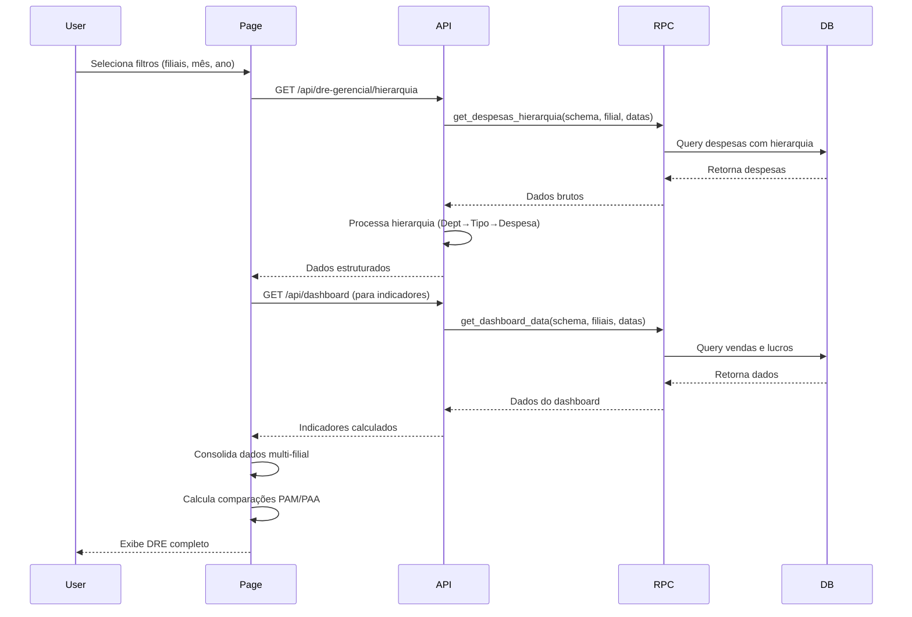

# DRE Gerencial - Documentação Técnica

## Índice

1. [Visão Geral](#visão-geral)
2. [Componentes e Funções](#componentes-e-funções)
3. [Índice Completo de Funções](./FUNCTIONS_INDEX.md) 📋
4. [Regras de Negócio](./BUSINESS_RULES.md)
5. [Estruturas de Dados](./DATA_STRUCTURES.md)
6. [Fluxo de Integração](./INTEGRATION_FLOW.md)
7. [Funções RPC Supabase](./RPC_FUNCTIONS.md)

---

## Visão Geral

O **DRE Gerencial** (Demonstrativo de Resultado do Exercício) é um módulo avançado de análise financeira que permite visualizar e comparar:

- **Despesas** organizadas em hierarquia (Departamento → Tipo → Despesa)
- **Indicadores Financeiros** com comparações temporais (PAM e PAA)
- **Análise Multi-Filial** consolidada ou individual
- **Comparações Temporais** automáticas entre períodos

### Características Principais

- ✅ **Análise Comparativa**: Compara período atual com PAM (Período Anterior Mesmo) e PAA (Período Anterior Acumulado)
- ✅ **Multi-Filial**: Suporta visualização consolidada de múltiplas filiais
- ✅ **Hierarquia 3 Níveis**: Departamento → Tipo de Despesa → Despesa Individual
- ✅ **Indicadores em Tempo Real**: Receita Bruta, CMV, Lucro Bruto, Despesas e Lucro Líquido
- ✅ **Restrições de Acesso**: Respeita permissões de filiais por usuário
- ✅ **Tabela Expansível**: Visualização hierárquica interativa

---

## Componentes e Funções

### Funções RPC (Supabase PostgreSQL)

| Função | Descrição | Localização |
|--------|-----------|-------------|
| `get_despesas_hierarquia` | Busca despesas com estrutura hierárquica por período e filial | Supabase RPC |
| `get_dashboard_data` | Busca dados do dashboard (vendas, lucro, margem) | Supabase RPC |

### API Routes (Next.js)

| Rota | Método | Descrição | Arquivo |
|------|--------|-----------|---------|
| `/api/dre-gerencial/hierarquia` | GET | Retorna hierarquia de despesas processada | [route.ts](../../../src/app/api/dre-gerencial/hierarquia/route.ts:1) |
| `/api/dashboard` | GET | Retorna indicadores do dashboard | [route.ts](../../../src/app/api/dashboard/route.ts:1) |

### Páginas

| Rota | Descrição | Arquivo |
|------|-----------|---------|
| `/dre-gerencial` | Página principal do módulo DRE | [page.tsx](../../../src/app/(dashboard)/dre-gerencial/page.tsx:1) |

### Componentes React

| Componente | Responsabilidade | Arquivo |
|------------|------------------|---------|
| `DespesasFilters` | Filtros de filiais, mês e ano | [filters.tsx](../../../src/components/despesas/filters.tsx:1) |
| `IndicatorsCards` | Cards de indicadores com comparações | [indicators-cards.tsx](../../../src/components/despesas/indicators-cards.tsx:1) |
| `DataTable` | Tabela hierárquica expansível | [data-table.tsx](../../../src/components/despesas/data-table.tsx:1) |
| `createColumns` | Factory de colunas dinâmicas | [columns.tsx](../../../src/components/despesas/columns.tsx:1) |
| `EmptyState` | Estados vazios (sem dados, erros) | [empty-state.tsx](../../../src/components/despesas/empty-state.tsx:1) |
| `LoadingState` | Estado de carregamento | [loading-state.tsx](../../../src/components/despesas/loading-state.tsx:1) |

### Hooks Utilizados

| Hook | Função | Origem |
|------|--------|--------|
| `useTenantContext` | Gerencia contexto do tenant atual | `@/contexts/tenant-context` |
| `useBranchesOptions` | Busca lista de filiais disponíveis | `@/hooks/use-branches` |

---

## Arquitetura do Módulo

```
┌─────────────────────────────────────────────────────────────┐
│                     DRE GERENCIAL PAGE                       │
│                  /dre-gerencial/page.tsx                     │
└────────┬──────────────────────────────────────┬─────────────┘
         │                                      │
         ├──────────────┐                       ├──────────────┐
         │              │                       │              │
    ┌────▼────┐    ┌────▼────────┐        ┌────▼──────┐  ┌────▼─────┐
    │ Filters │    │ Indicators  │        │ DataTable │  │  Empty/  │
    │         │    │   Cards     │        │ (Tabela   │  │ Loading  │
    │         │    │             │        │Hierárquica│  │  States  │
    └────┬────┘    └──────┬──────┘        └─────┬─────┘  └──────────┘
         │                │                     │
         │                │                     │
    ┌────▼────────────────▼─────────────────────▼────┐
    │           API ROUTE HANDLERS                   │
    ├────────────────────────────────────────────────┤
    │  /api/dre-gerencial/hierarquia                 │
    │  /api/dashboard                                │
    └────────────┬───────────────────────────────────┘
                 │
                 │
    ┌────────────▼───────────────────────────────────┐
    │         SUPABASE RPC FUNCTIONS                 │
    ├────────────────────────────────────────────────┤
    │  • get_despesas_hierarquia(...)                │
    │  • get_dashboard_data(...)                     │
    └────────────┬───────────────────────────────────┘
                 │
                 │
    ┌────────────▼───────────────────────────────────┐
    │      POSTGRESQL DATABASE (Multi-Schema)        │
    ├────────────────────────────────────────────────┤
    │  Schema: okilao, saoluiz, paraiso, lucia       │
    │  Tabelas: despesas, vendas, produtos, etc.     │
    └────────────────────────────────────────────────┘
```

---

## Fluxo de Dados Simplificado



---

## Conceitos-Chave

### 1. **Hierarquia de Despesas**

```
TOTAL DESPESAS
├── Departamento (ex: "IMPOSTOS E TAXAS")
│   ├── Tipo (ex: "SIMPLES NACIONAL")
│   │   ├── Despesa 1 (nota fiscal individual)
│   │   ├── Despesa 2
│   │   └── Despesa 3
│   └── Tipo (ex: "IPTU")
│       └── Despesa 1
└── Departamento (ex: "PESSOAL")
    └── Tipo (ex: "SALÁRIOS")
        └── ...
```

### 2. **Comparações Temporais**

- **PAM (Período Anterior Mesmo)**: Mês anterior ao selecionado
  - Exemplo: Se selecionado Outubro/2024, PAM = Setembro/2024

- **PAA (Período Anterior Acumulado)**: Mesmo mês do ano anterior
  - Exemplo: Se selecionado Outubro/2024, PAA = Outubro/2023

### 3. **Indicadores Financeiros**

| Indicador | Cálculo | Descrição |
|-----------|---------|-----------|
| **Receita Bruta** | Soma total de vendas | Volume de vendas antes de deduções |
| **CMV** | Receita Bruta - Lucro Bruto | Custo das Mercadorias Vendidas |
| **Lucro Bruto** | Receita - CMV | Lucro antes das despesas operacionais |
| **Total Despesas** | Soma de todas as despesas | Despesas operacionais totais |
| **Lucro Líquido** | Lucro Bruto - Total Despesas | Lucro após todas as despesas |
| **Margem Bruta** | (Lucro Bruto / Receita Bruta) × 100 | % de margem bruta |
| **Margem Líquida** | (Lucro Líquido / Receita Bruta) × 100 | % de margem líquida |

### 4. **Multi-Filial**

O módulo permite:
- Selecionar múltiplas filiais simultaneamente
- Consolidar dados de forma automática
- Comparar valores entre filiais (média vs individual)
- Aplicar restrições de acesso por usuário

---

## Próximos Documentos

- **[Regras de Negócio](./BUSINESS_RULES.md)**: Lógica de cálculo, validações e restrições
- **[Estruturas de Dados](./DATA_STRUCTURES.md)**: Interfaces TypeScript, schemas e tipos
- **[Fluxo de Integração](./INTEGRATION_FLOW.md)**: Detalhamento técnico das chamadas de API
- **[Funções RPC](./RPC_FUNCTIONS.md)**: Documentação das funções PostgreSQL

---

## Manutenção e Atualizações

**Última atualização**: 2025-01-11
**Responsável**: Equipe de Desenvolvimento BI SaaS
**Versão do Módulo**: 1.0.0

Para reportar problemas ou sugerir melhorias, consulte o [CHANGELOG.md](../../../CHANGELOG.md) do projeto.
