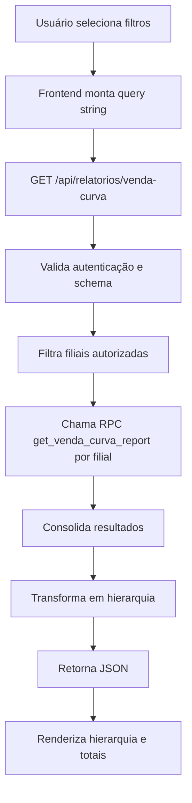
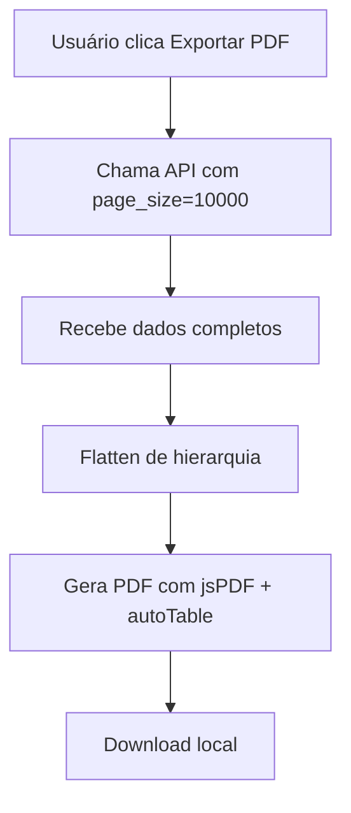

# Fluxo de Integração - Vendas por Curva

> Status: ✅ Implementado

## Visão Geral

O fluxo integra frontend, API e RPC do Supabase para gerar o relatório com hierarquia de departamentos e produtos classificados por curva.

## Fluxo Principal (Frontend → Backend)

## Sequência Detalhada

1. **UI** define filtros: mês, ano e filiais.
2. **Frontend** chama:
   - `GET /api/relatorios/venda-curva?schema=...&mes=...&ano=...&filial_id=...&page=...&page_size=...`
3. **API** valida:
   - autenticação
   - acesso ao schema (`validateSchemaAccess`)
   - filiais autorizadas (`getUserAuthorizedBranchCodes`)
4. **RPC** `get_venda_curva_report`:
   - Filtra período e filial
   - Agrega vendas por produto e departamento
   - Calcula quantidade, valor, lucro e percentual
   - Quando o filtro é o **mês/ano atual**, o comparativo do ano anterior é limitado ao período **D-1**
5. **API** organiza hierarquia:
   - Nível 3 → Nível 2 → Nível 1 → Produtos
   - Soma totais e calcula margem
6. **UI** renderiza hierarquia com `Collapsible` e tabela de produtos.

## Estados de Tela

- **Loading**: exibe skeletons enquanto carrega.
- **Erro**: exibe card de erro com mensagem.
- **Sem dados**: exibe estado vazio.
- **Com dados**: exibe hierarquia e paginação.

## Fluxo de Exportação PDF

## Transformações de Dados

- **RPC** retorna dados planos.
- **API**:
  - Agrupa por depto 3/2/1
  - Soma `valor_vendido` e `lucro_total`
  - Calcula `percentual_lucro` por nível
- **Frontend** aplica filtro de produto (debounce) e expande hierarquia automaticamente.

## Pontos de Integração

- **Frontend**: `src/app/(dashboard)/relatorios/venda-curva/page.tsx`
- **API**: `src/app/api/relatorios/venda-curva/route.ts`
- **RPC**: `public.get_venda_curva_report`
- **Tabelas**: `demo.vendas`, `demo.produtos`, `demo.departments_level_1/2/3`
